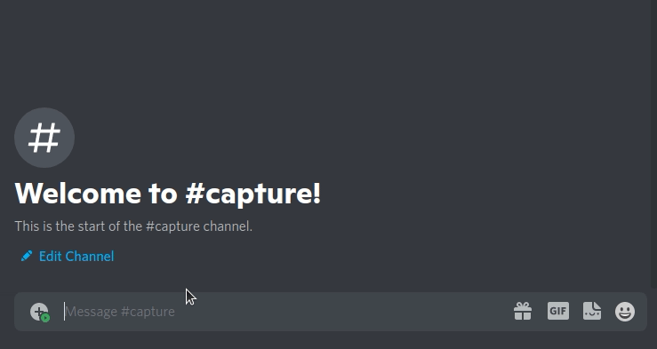
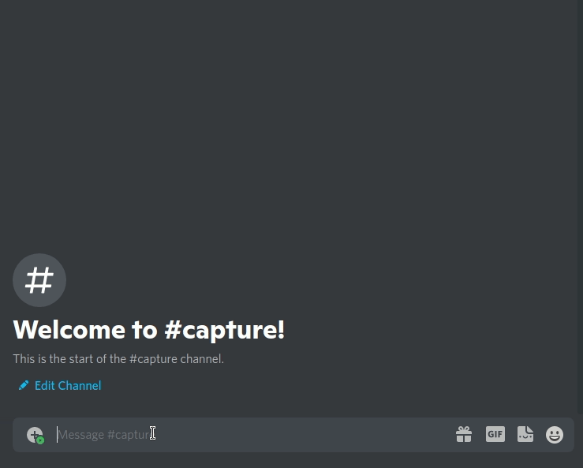
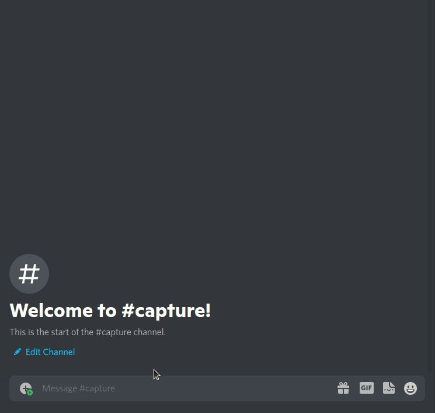
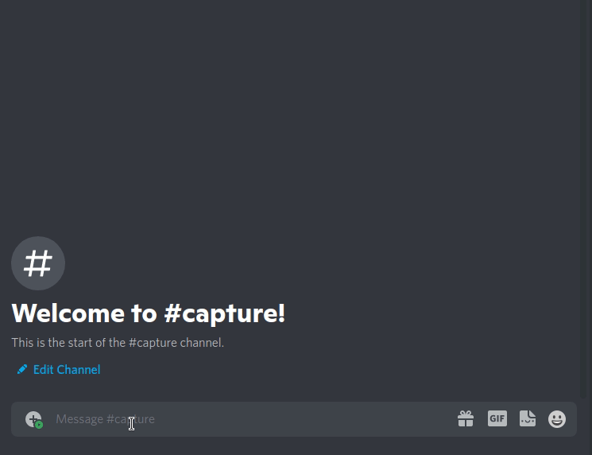

# Discord Stocks Bot

**DALI Lab Submission for the API Challenge**

Stocks Bot: Discord bot where you can buy stocks with fake cash and compete with your friends for the most profit!

## API's Used

### Discord Developers API (https://discord.com/developers/)

Connected code with discord application

### IEXCloud REST API (https://www.iexcloud.io/)

Handled collection of stock and pricing data

### MongoDB Database API (https://www.mongodb.com/)

Stored portfolios of users

## Code

The main code is located in "events.py", "ledger.py" and "stocks.py"

Events.py - Handles the asyncronous tasks that connects the Discord API to the 
rest of the scripts. Connects directly through the Discord.py library (another 
library that implements a connection to Discord API). Uses function blocks to 
call various commands on the actual discord app.

Ledger.py - Handles the database application through a MongoDB connection.
Connects to MongoDB through pyMongo (a mongo DB interface for python) and uses
a class method to encapsulate all the ledger commands into an object that can then 
be passed into the events file for easy access. *Other implementations of the Database 
could also work as long as they have all the methods in the Ledger Class. 

Stocks.py - Handles the retrieval of stock data through the IEXCloud API. 
Uses web requests to various endpoints on the IEXCloud webservers that provide
realtime stock information and stores them in cache in order to rate limit the requests. 
All these methods are encapsulated into the Stocks class which can then be passed 
into the events file for easy access to its methods. *Other implementations of the Stocks 
API could also work as long as they have all the methods in the Stocks Class. 

## Bot Functions

### Buying

### Checking Portfolio 

### Checking Stock Trend

### Checking Leaderboard

### Viewing Commands on Discord

