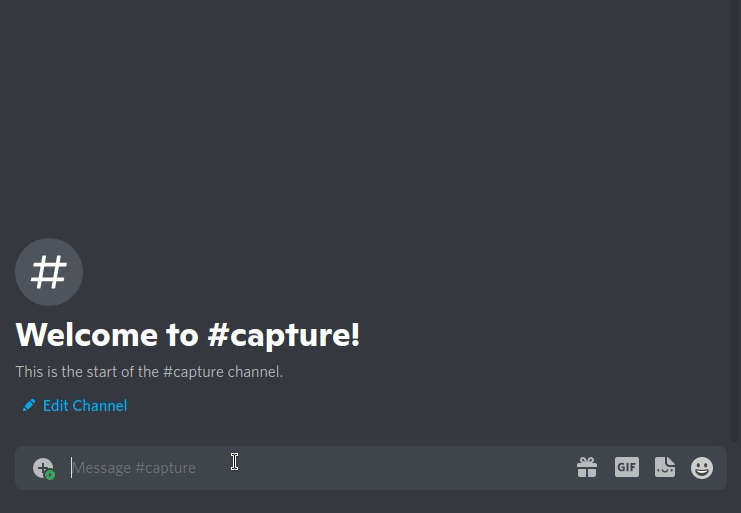

# Discord Stocks Bot

**DALI Lab Submission for the API Challenge**

Stocks Bot: Discord bot where you can buy stocks with fake cash and compete with your friends for the most profit!

## API's Used

### Discord Developers API (https://discord.com/developers/)

Connected code with discord application

### IEXCloud REST API (https://www.iexcloud.io/)

Handled collection of stock and pricing data

### MongoDB Database API (https://www.mongodb.com/)

Stored portfolios of users

## Bot Functions

### Buying

### Checking Portfolio 

### Checking Stock Trend

### Checking Leaderboard

### Viewing Commands on Discord

